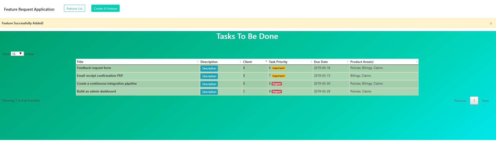

# Feature Request Application
[](https://www.python.org/downloads/release/python-373/)




> A web application that allows IWS employees to add a client's 'feature requests' to an existing piece of software.

 IWS employees are able to prioritize 'feature requests' that clients would like to have added to a piece of existing software.
 The IWS employee is able to add a description, due date, priority number (0 being least important to 9 being very urgent) as well as
 product area and which client requested the feature.

 Employees are able to view a table with all of the feature requests from all of the clients, and order them via any of the attributes (title & priority, client & priority, priority & title...etc.)
 Feature Requests with higher priority have an urgent badge while tasks with lower priority have a 'save for later' badge.

 ## Table of Contents
- [Demo](#demo)
- [Pre-Requisites](#prerequisites)
- [Install/Run Locally](#install)
- [Install/Run with docker-compose](#Docker)
- [Features](#features)
- [Running Tests](#tests)
- [Tools Used](#tools)
- [Deployment Method](#deployment)
- [Known Issues/To Do](#issues)


## Demo:

> http://167.99.181.38


## Prerequisites

- Docker
- Docker Compose
- Python 3.7
- Flask
- SQLAlchemy

## Install

To run this repository locally, first clone it:
```sh
git clone https://github.com/leungvb/FeatureRequest.git
```
and then change directory:
```sh
cd FeatureRequest
```
Create a virtual environment with python 3.7:
```sh
virtualenv venv --python=python3.7
```
Activate the virtual environment:
```sh
. venv/bin/activate
```
Install all requirements from requirements.txt:
```sh
pip install -r requirements.txt
```
Run the application:
```sh
python app.py
```
View the application at:
http://0.0.0.0:8000

## Docker


In order to run this repository with Docker/Docker-compose on Linux, remove older versions of docker-compose and reinstall newest version:
```sh
sudo rm /usr/local/bin/docker-compose
sudo curl -L "https://github.com/docker/compose/releases/download/1.23.2/docker-compose-$(uname -s)-$(uname -m)" -o /usr/local/bin/docker-compose
```
Apply executable permissions to the binary:
```sh
sudo chmod +x /usr/local/bin/docker-compose
```
Clone the repository:
```sh
https://github.com/leungvb/FeatureRequest.git
```
Change Directory into FeatureRequest:
```sh
cd FeatureRequest
```
Start Service In The Background:
```sh
docker-compose up -d
```
View the application at:
http://0.0.0.0 or http://localhost:8000

## Features

This application was made with Flask, WTForms, Flask-SQLAlchemy, and SQLite. The front end consists of Jinja2 templates, Bootstrap, JQuery and the DataTables plugin.
Docker-compose was used for the deployment of this application, which runs the web application & gunicorn in one container and nginx in the other container. The Docker-compose file downloads
an image from the remote Dockerhub, which was built with the local Dockerfile.

## Deployment

An image was created from the Dockerfile and then pushed up to a public repository on the Dockerhub. Although this may be more resource intensive, updates to the production server
are done easily as the docker-compose file only has to download the newly tagged image. Nginx serves up the static files, and nginx configurations are volume mounted into the nginx container and allow communication to the
web container which hosts the flask application. Since the application was deployed to an IP address instead of an actual domain, a wildcard (_) was used in the nginx.conf files.
The only main difference between the production and development configurations are that the environment variables for the SECRET_KEY (which is needed to enable CSRF protection) are hard-coded
in development, and in production are hard-coded in the docker-compose.yml.

## Tests

To run the test suite:
Create the virtual environment, install all requirements, and run the tests
```sh
virtualenv venv --python=python3.7
. venv/bin/activate
pip install -r requirements.txt
python -m unittest
```
## Tools
- Python
- Flask
- SQLAlchemy
- SQLite
- Javascript/JQuery
- Jinja2
- Bootstrap
- DataTables Plugin
- Nginx
- Docker/Docker-Compose

## Issues
For simplicity, the dockerfile used contains the SQLite database. In reality a better option would have been to have used a Postgres database in its own separate container.
The docker containers all run in root, however a user should have been created for security purposes. Environment variables are hard coded in the docker-compose.yml. A service should be used in the event the containers crash
or fail. Logging should also be added to the docker containers.

