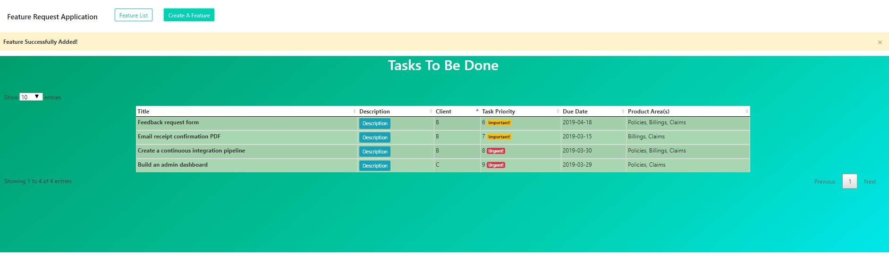

# Feature Request Application
[](https://www.python.org/downloads/release/python-373/)




> A web application that allows IWS employees to add a client's 'feature requests' to an existing piece of software.

 IWS employees are able to prioritize 'feature requests' that clients would like to have added to a piece of existing software.
 The IWS employee is able to add a description, due date, priority number (0 being least important to 9 being very urgent) as well as
 product area and which client requested the feature.

 Employees are able to view a table with all of the feature requests from all of the clients, and order them via any of the attributes (title & priority, client & priority...etc.)
 Feature Requests with higher priority have an urgent badge while tasks with lower priority have a 'save for later' badge.

 ## Table of Contents
- [Demo](#demo)
- [Pre-Requisites](#prerequisites)
- [Install/Run Locally](#install)
- [Install/Run with docker-compose](#Docker)
- [Features](#features)
- [Running Tests](#tests)
- [Tools Used](#tools)
- [Deployment Method](#deployment)
- [Configuration](#configuration)
- [Known Issues/To Do](#issues)


## Demo:

> [Demo](http://167.99.181.38)


## Prerequisites

- Docker
- Docker Compose
- Python 3.7
- Flask
- SQLAlchemy
- PostgreSQL
- Nginx

## Install

To run this repository locally, first clone it:
```sh
git clone https://github.com/leungvb/FeatureRequest.git
```
and then change directory:
```sh
cd FeatureRequest
```
build the docker image locally:
```sh
docker-compose build
```
use docker-compose in detached mode to start nginx, postgres and the web containers:
```sh
docker-compose up -d
```
Apply database initialization and migrations:
```sh
docker exec -it featurerequest_web_1 python manage.py db init
docker exec -it featurerequest_web_1 python manage.py db migrate
docker exec -it featurerequest_web_1 python manage.py db upgrade
```
View the application at:
```sh
http://0.0.0.0/
```

If database initialization or migrations did not work, try "docker ps" and check the name for the web container (default is featurerequest_web_1):
```sh
docker exec -it <web_container_name> python manage.py db init
docker exec -it <web_container_name> python manage.py db migrate
docker exec -it <web_container_name> python manage.py db upgrade
```

## Features

This application was made with Flask, WTForms, Flask-SQLAlchemy, and PostgreSQL. The front end consists of Jinja2 templates, Bootstrap, JQuery and the DataTables plugin.
It is a multi-container/microservices application that uses docker-compose to orchestrate communication between Nginx, PostgreSQL, and the Flask web application.
It is complete with logging of the Nginx & Flask Web container, tests for the application, persistent database volumes, and configuration settings for production and development environments.

Features submitted by the form can be ordered by multiple columns, that is, by "priority" first & "client" second, or by any other two categories (by pressing shift + column).
By default the table is ordered by the "priority" column.


## Deployment

Using the files from the repository, an image is built from the Dockerfile and then docker-compose.yml is used to initialize the Nginx, PostgreSQL and Flask Web containers.
Although docker-compose is able to handle the initialization order of the containers, it doesn't necessarily wait for all containers to complete setup before the next container is started.
The initialization order of these containers are important, as the web and nginx containers would depend on the PostgreSQL container to complete setup. Health checks to the PostgreSQL container
were considered, but since the initialization script for the database is only ran once, it did not seem necessary to incorporate. An empty directory was volume mounted to the PostgreSQL container
for persistent data.

## Tests

To run the test suite, make sure the application is up and running:
```sh
docker-compose exec -it <web_container_name> python -m unittest
```


## Configuration

Configuration settings are located in the '.env' file. The "env_file" directive in the docker-compose.yml file passes these environment variables to the web and db container.
PostgreSQL user, password and database name are located in the 'init.sql' file and would need to be changed to the same values as those in the '.env' file.
You can switch from Production to Development environments in app.py by setting 'ENVIRONMENT = ProductionConfig' or 'ENVIRONMENT = DevelopmentConfig'.

## Tools
- Python 3.7
- Flask
- Docker/Docker-Compose
- PostgreSQL
- SQLAlchemy
- Javascript/JQuery
- Jinja2
- Bootstrap
- DataTables Plugin
- Nginx


## Issues

Although I haven't had any issues with running the application, potential issues could arise from the communication between the DB container (postgres) and the web container (flask application).
The database initialization script (init.sql) is only run the first time, so it might take a bit longer to setup the database. This could cause potential connection issues for the web container
listening on port 5432. However after the first time running this application (and all the migrations) the issues should subside.

If you would like to make changes to the models of this application, it is suggested that the "newdbdata" directory be deleted and recreated/emptied, because the database initialization
script is only ran if this postgresql data volume is empty.